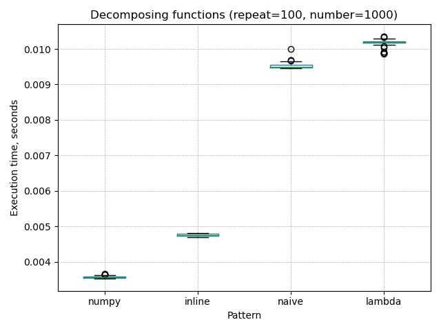
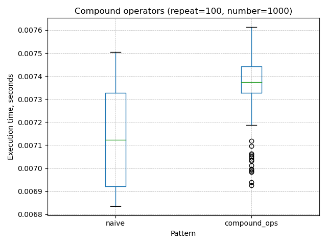
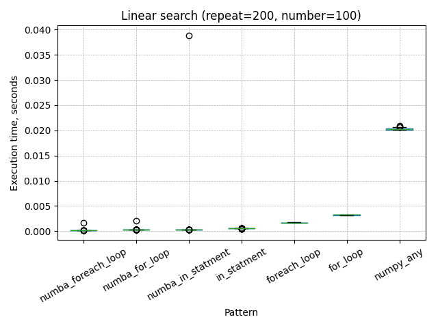

# Simple python benchmarks

## Description

The following are very preliminary benchmark results for patterns commonly used when writing python programs.

System: Linux x86_64 (6.0.12-gentoo)  
Processor: AMD Ryzen 9 5950X 16-Core Processor

**repeats** -  how many times to run benchmark (samples)  
**numbers** - hom many cicles in each benchmarks run

## Benchmarks

### Sequence generation [<kbd>&rarr;</kbd>](benchmarks/python/sequence_generation.py)

Ways to generate sequences

|                    |     mean |      std |      min |       5% |      50% |      95% |      max |
|--------------------|----------|----------|----------|----------|----------|----------|----------|
| generator          | 2.35e-04 | 2.72e-06 | 2.31e-04 | 2.32e-04 | 2.35e-04 | 2.39e-04 | 2.52e-04 |
| map+filter         | 2.70e-04 | 3.91e-06 | 2.64e-04 | 2.66e-04 | 2.70e-04 | 2.75e-04 | 2.98e-04 |
| list comprehension | 3.52e-03 | 1.40e-05 | 3.49e-03 | 3.50e-03 | 3.52e-03 | 3.54e-03 | 3.56e-03 |
| list forloop       | 4.07e-03 | 1.51e-05 | 4.02e-03 | 4.05e-03 | 4.06e-03 | 4.09e-03 | 4.13e-03 |

### Dataclass pattern [<kbd>&rarr;</kbd>](benchmarks/python/dataclass.py)

Storing a small amount of annotated data (aka structs)

|            |     mean |      std |      min |       5% |      50% |      95% |      max |
|------------|----------|----------|----------|----------|----------|----------|----------|
| dicitonary | 1.46e-03 | 3.26e-05 | 1.37e-03 | 1.42e-03 | 1.45e-03 | 1.51e-03 | 1.55e-03 |
| class      | 1.67e-03 | 1.24e-05 | 1.64e-03 | 1.65e-03 | 1.67e-03 | 1.68e-03 | 1.69e-03 |
| dataclass  | 1.69e-03 | 1.04e-05 | 1.66e-03 | 1.67e-03 | 1.69e-03 | 1.70e-03 | 1.71e-03 |
| namedtuple | 2.32e-03 | 1.60e-05 | 2.30e-03 | 2.30e-03 | 2.31e-03 | 2.34e-03 | 2.36e-03 |

### Decomposing functions [<kbd>&rarr;</kbd>](benchmarks/python/func_call.py)

Splitting a function into smaller subfunctions

|        |     mean |      std |      min |       5% |      50% |      95% |      max |
|--------|----------|----------|----------|----------|----------|----------|----------|
| numpy  | 3.57e-03 | 3.11e-05 | 3.53e-03 | 3.53e-03 | 3.57e-03 | 3.63e-03 | 3.66e-03 |
| inline | 4.76e-03 | 2.94e-05 | 4.70e-03 | 4.72e-03 | 4.75e-03 | 4.81e-03 | 4.82e-03 |
| naive  | 9.52e-03 | 7.39e-05 | 9.45e-03 | 9.46e-03 | 9.50e-03 | 9.64e-03 | 1.00e-02 |
| lambda | 1.02e-02 | 8.39e-05 | 9.86e-03 | 1.00e-02 | 1.02e-02 | 1.03e-02 | 1.04e-02 |

### Caching import methods [<kbd>&rarr;</kbd>](benchmarks/python/module_import.py)

|          |     mean |      std |      min |       5% |      50% |      95% |      max |
|----------|----------|----------|----------|----------|----------|----------|----------|
| direct   | 3.18e-03 | 1.71e-05 | 3.14e-03 | 3.15e-03 | 3.18e-03 | 3.21e-03 | 3.23e-03 |
| indirect | 3.59e-03 | 4.69e-05 | 3.54e-03 | 3.55e-03 | 3.58e-03 | 3.68e-03 | 3.83e-03 |

### Global variables [<kbd>&rarr;</kbd>](benchmarks/python/global_var.py)

|           |     mean |      std |      min |       5% |      50% |      95% |      max |
|-----------|----------|----------|----------|----------|----------|----------|----------|
| write []  | 4.75e-05 | 5.36e-07 | 4.67e-05 | 4.68e-05 | 4.75e-05 | 4.86e-05 | 4.95e-05 |
| append [] | 5.10e-05 | 9.58e-07 | 4.99e-05 | 5.01e-05 | 5.07e-05 | 5.25e-05 | 5.74e-05 |

### Compound assignment operators [<kbd>&rarr;</kbd>](benchmarks/python/compound_assignment_ops.py)

|              |     mean |      std |      min |       5% |      50% |      95% |      max |
|--------------|----------|----------|----------|----------|----------|----------|----------|
| naive        | 7.14e-03 | 1.85e-04 | 6.84e-03 | 6.86e-03 | 7.12e-03 | 7.40e-03 | 7.50e-03 |
| compound_ops | 7.34e-03 | 1.55e-04 | 6.93e-03 | 7.00e-03 | 7.37e-03 | 7.55e-03 | 7.61e-03 |

### Switch case [<kbd>&rarr;</kbd>](benchmarks/python/switch_case.py)

|             |     mean |      std |      min |       5% |      50% |      95% |      max |
|-------------|----------|----------|----------|----------|----------|----------|----------|
| dict        | 9.91e-03 | 9.47e-05 | 9.75e-03 | 9.77e-03 | 9.90e-03 | 1.01e-02 | 1.03e-02 |
| if_else     | 4.95e-02 | 6.41e-04 | 4.77e-02 | 4.79e-02 | 4.97e-02 | 5.01e-02 | 5.03e-02 |
| switch_case | 4.97e-02 | 5.38e-04 | 4.84e-02 | 4.88e-02 | 4.98e-02 | 5.04e-02 | 5.06e-02 |

### Linear search [<kbd>&rarr;</kbd>](benchmarks/python/linear_search.py)

Runs through the elements of the input unsorted vector of int until finding the value being searched (successful search) or reaching the end of the vector (unsuccessful search).

|                    |     mean |      std |      min |       5% |      50% |      95% |      max |
|--------------------|----------|----------|----------|----------|----------|----------|----------|
| numba_in_statment  | 9.43e-04 | 2.18e-04 | 9.18e-04 | 9.19e-04 | 9.20e-04 | 9.26e-04 | 3.10e-03 |
| numba_foreach_loop | 1.43e-03 | 1.44e-04 | 1.41e-03 | 1.41e-03 | 1.42e-03 | 1.44e-03 | 2.86e-03 |
| numba_for_loop     | 1.91e-03 | 2.79e-04 | 1.59e-03 | 1.59e-03 | 1.76e-03 | 2.26e-03 | 3.20e-03 |
| in_statment        | 3.83e-03 | 1.88e-05 | 3.79e-03 | 3.80e-03 | 3.84e-03 | 3.85e-03 | 3.86e-03 |
| foreach_loop       | 1.24e-02 | 3.55e-05 | 1.23e-02 | 1.23e-02 | 1.24e-02 | 1.25e-02 | 1.25e-02 |
| numpy_any          | 2.07e-02 | 2.39e-04 | 2.03e-02 | 2.03e-02 | 2.06e-02 | 2.11e-02 | 2.13e-02 |
| for_loop           | 2.33e-02 | 1.18e-03 | 2.18e-02 | 2.20e-02 | 2.24e-02 | 2.45e-02 | 2.46e-02 |

### Binary tree [<kbd>&rarr;</kbd>](benchmarks/python/binary_tree.py)

|             |     mean |      std |      min |       5% |      50% |      95% |      max |
|-------------|----------|----------|----------|----------|----------|----------|----------|
| naive class | 4.99e-02 | 4.36e-04 | 4.89e-02 | 4.93e-02 | 4.99e-02 | 5.08e-02 | 5.11e-02 |